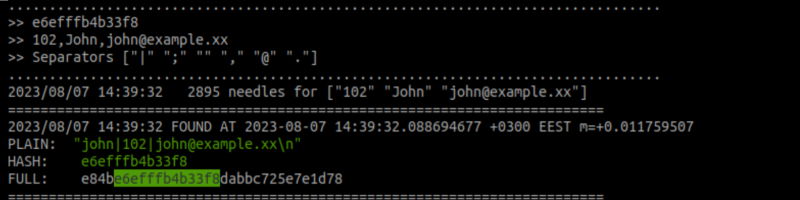

# hashtrace
_HashTrace_ is a utility designed to guess the hash based on provided content fragments.

By iterating through common combinations, HashTrace provides insights into the robustness of hash generation, revealing vulnerabilities in weak or poorly created hashes.

## Problem
Often, developers inadvertently leave hashes—either in full or fragments—on webpages and other digital realms, considering them to be *secure*. 
However, the truth can be starkly different. 
When these hashes are generated without integrating substantial additional data or are just poorly constructed, their veneer of security can be easily pierced. **HashTrace** steps into this arena, acting as the beacon of clarity. 
Presented with the challenges of partial hashes or disparate content fragments, it effectively bridges the chasm of missing information. 
By methodically iterating through potential combinations, HashTrace not only reconstructs the probable plaintext but also underlines the pitfalls of blind trust in these hashes.


### Use Case Example: 
Imagine a Secret: the plaintext is derived from the command:
```bash
echo "john|102|john@example.xx" | md5sum
```
This produces the hash `e84be6efffb4b33f8dabbc725e7e1d78`.

Given known input data: `102`, `John`, and` john@example.xx` (along with the hash or its fragment), 
HashTrace assists in unveiling the mystery behind the order and format in which these data segments were originally hashed.

## Usage
```bash
./hashtrace -hash='e6efffb4b33f8' -data=102 -data=John --data=john@example.xx
# ./hashtrace -hash='e6efffb4b33f8' -data=102 -data=John --data=john@example.xx -sep=';' -sep='|' -sep=',' 
```



### Supported Hash Algorithms
- `MD5`
- `SHA1`
- `SHA256`
- `SHA512`
- `SHA224`
- `SHA384`
- `SHA3-256`
- `SHA3-512`
- `SHA512-224`
- `SHA512-256`
